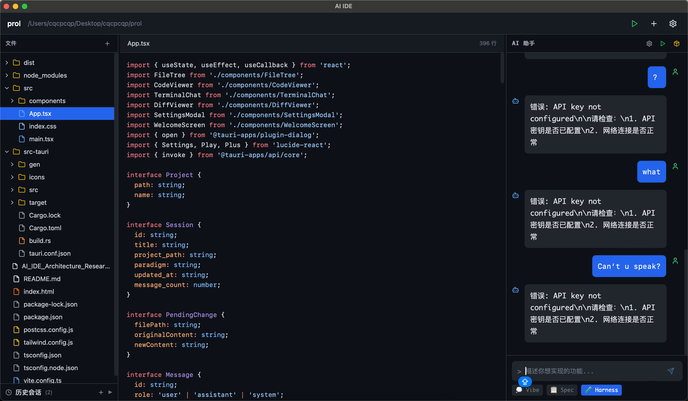

# AI IDE

AI 原生 IDE - 面向产品经理的零配置开发环境。

## 技术栈

- **前端**: React 18 + TypeScript + Vite + Tailwind CSS
- **后端**: Rust + Tauri v2
- **代码高亮**: Shiki
- **图标**: Lucide React

## 环境要求

- [Node.js](https://nodejs.org/) 18+ 
- [Rust](https://www.rust-lang.org/tools/install) 1.75+ (运行桌面版需要)

## 快速开始

### 1. 克隆项目并进入目录

```bash
cd ai-ide
```

### 2. 安装依赖

```bash
npm install
```

### 3. 启动项目

有两种运行方式：

#### 方式一：Web 模式（浏览器）

适合前端开发和快速预览：

```bash
npm run dev
```

打开浏览器访问 http://localhost:1420

#### 方式二：桌面应用模式（Tauri）

完整的桌面应用体验：

```bash
npm run tauri dev
```

首次运行会自动下载 Rust 依赖并编译，可能需要几分钟。

## 常用命令

| 命令 | 说明 |
|------|------|
| `npm run dev` | 启动 Web 开发服务器 |
| `npm run build` | 构建生产版本 |
| `npm run preview` | 预览生产构建 |
| `npm run tauri dev` | 启动桌面应用开发模式 |
| `npm run tauri build` | 打包桌面应用 |

## 项目结构

```
├── src/                  # 前端源代码
│   ├── App.tsx          # 主应用组件
│   ├── main.tsx         # 入口文件
│   ├── index.css        # 全局样式
│   └── components/      # 组件目录
├── src-tauri/           # Tauri/Rust 后端
│   ├── src/             # Rust 源代码
│   ├── Cargo.toml       # Rust 依赖配置
│   └── tauri.conf.json  # Tauri 配置
├── index.html           # HTML 入口
├── package.json         # Node 依赖配置
├── tsconfig.json        # TypeScript 配置
├── vite.config.ts       # Vite 配置
└── tailwind.config.js   # Tailwind CSS 配置
```

## 构建桌面应用

打包为可执行文件：

```bash
npm run tauri build
```

构建完成后，安装包位于 `src-tauri/target/release/bundle/` 目录。

## 常见问题

### 1. `cargo` 命令未找到

需要安装 Rust：

```bash
curl --proto '=https' --tlsv1.2 -sSf https://sh.rustup.rs | sh
source $HOME/.cargo/env
```

### 2. 端口被占用

修改 `src-tauri/tauri.conf.json` 中的 `devUrl` 端口，或关闭占用 1420 端口的程序。

### 3. 构建失败

尝试清理缓存后重新构建：

```bash
rm -rf node_modules dist src-tauri/target
npm install
npm run tauri dev
```

## 开发说明

- 前端代码修改后会热更新
- Rust 代码修改后会自动重新编译
- Tauri API 文档：https://tauri.app/reference/

